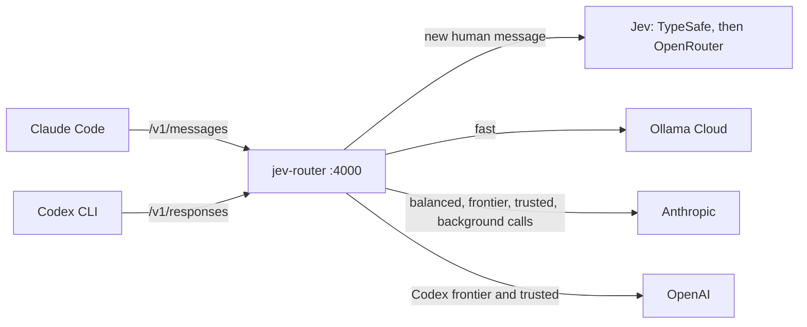

# Test jev-router in a Docker Sandbox

This guide runs Claude Code and the Codex CLI through jev-router in a fresh
[Docker Sandbox](https://docs.docker.com/ai/sandboxes/). On each new human message, Jev decides whether the session
needs the `fast` tier (Ollama Cloud), the `balanced` tier or the `frontier` tier (Anthropic or OpenAI). The keys stay
in your macOS keychain, and the sandbox proxy adds them to outgoing requests, so they never enter the sandbox. The
guide ends with a live measurement of Jev on the 58 labeled prompts.

It takes about 30 minutes, and the API spend is a few cents.



The comments in the commands mark what has been run before:

- **verified** is backed by a successful run or by the Docker Sandboxes docs.
- **not run yet** hasn't run end to end. The check in the next step tells you whether it worked.

## What you need

- `sbx` 0.39 or later on your Mac, signed in with `sbx login`. Install it with
  `brew trust docker/tap && brew install docker/tap/sbx` (verified).
- A Jev key: TypeSafe (`console.typesafe.ai`, model `jev-1.13.0`) or OpenRouter (needs credits). One is enough.
- An Ollama Cloud API key, and optionally an OpenAI API key, which only Codex's `frontier` and `trusted` tiers use.
- For Anthropic, your Claude login works as is (verified): the router passes Claude Code's own credential to
  Anthropic only.

## 1. Host: clone, store the keys, create the sandbox

The sandbox mounts your clone at the same path, so the router runs from your checkout.

```bash
export WS="$HOME/src/jev-router"                                      # any directory
git clone git@github.com:dirien/jev-router.git "$WS"

sbx kit validate "$WS/sbx/jev-router-kit"                             # not run yet: first run of this kit
printf '%s' "$TYPESAFE_API_KEY"   | sbx secret set typesafe          # service id declared by the kit
printf '%s' "$OPENROUTER_API_KEY" | sbx secret set openrouter        # optional failover channel (verified)
printf '%s' "$OLLAMA_API_KEY"     | sbx secret set ollama-cloud      # service id declared by the kit
printf '%s' "$OPENAI_API_KEY"     | sbx secret set openai            # optional (verified)
sbx create --name jev-router --kit "$WS/sbx/jev-router-kit" claude "$WS"   # flags verified; kit not run yet
```

Leave out the `printf … |` part to type a key at a prompt instead. The kit,
[`sbx/jev-router-kit/spec.yaml`](../sbx/jev-router-kit/spec.yaml), declares the four keys as proxy-managed services
and allows their hosts through the sandbox's network policy. Inside the sandbox each key variable holds the
placeholder `proxy-managed`, and the proxy writes the real `Authorization` header on the way out.

The first interactive run asks you to approve the kit's credential bindings, and since `sbx` 0.43 the default
answer is **No**. Answer yes. To skip the prompt, merge this into `~/.config/sbx/credentials.yaml` first:

```yaml
bindings:
  openrouter:   { apiKey: { domains: [openrouter.ai] } }
  typesafe:     { apiKey: { domains: [api.typesafe.ai] } }
  ollama-cloud: { apiKey: { domains: [ollama.com] } }
  openai:       { apiKey: { domains: [api.openai.com] } }
```

## 2. Sandbox shell 1: install, test, start the router

```bash
sbx exec -it -w "$WS" jev-router bash                                # verified
```

Inside the sandbox:

```bash
node --version && echo "NODE_USE_ENV_PROXY=$NODE_USE_ENV_PROXY"    # Node 22 or newer, and the variable must be 1
placeholder=proxy-managed                                            # what the kit puts in every key variable
for u in https://api.typesafe.ai/v1/models https://openrouter.ai/api/v1/key https://ollama.com/api/ps https://api.openai.com/v1/models; do
  printf '%s  %s\n' "$(curl -s -o /dev/null -w '%{http_code}' -H "Authorization: Bearer $placeholder" "$u")" "$u"
done                                                                 # 200: the key is injected; 401: it isn't
npm ci && npm test                                                   # offline tests, no network (verified)
npm link || sudo npm link                                            # puts jev-router on the PATH
jev-router init                                                      # writes ~/.config/jev-router/config.json
jev-router doctor
jev-router serve 2>&1 | tee -a router.log                            # keep this running
```

The kit sets both Jev key variables, so the router treats both channels as configured. If you stored only one Jev
key, delete the other channel from `jev.channels` in `~/.config/jev-router/config.json` before `jev-router serve`.
Otherwise the router spends a failed attempt on it every five minutes.

Node's built-in `fetch` uses the sandbox proxy only when `NODE_USE_ENV_PROXY=1`. Without it, requests bypass the
proxy, no key gets injected, and every upstream answers 401.

To watch the routing live, run the view on the host. `router.log` lands in the shared workspace folder, so the host
sees every line as the router writes it:

```bash
cd "$WS" && npm run ui -- router.log                                  # then open http://127.0.0.1:4100
```

It needs Node 22 or newer on the host, and no `npm ci`: the router has no runtime dependencies.

## 3. Sandbox shell 2: smoke test and health

```bash
sbx exec -it -w "$WS" jev-router bash
curl -s http://127.0.0.1:4000/healthz | python3 -m json.tool        # jev.configured: true, one entry per channel
curl -si http://127.0.0.1:4000/v1/messages \
  -H 'content-type: application/json' -H 'anthropic-version: 2023-06-01' \
  -d '{"model":"claude-sonnet-5","max_tokens":64,"messages":[{"role":"user","content":"Rename the variable foo to bar in utils.ts"}]}' \
  | grep -iE '^(HTTP/|x-jev-)'
```

Expect `x-jev-reason: jev` with `x-jev-model: glm-5.3-flash` (Ollama Cloud). If Jev is less than 85% sure, you get
`jev-escalated` with Sonnet 5. The `route` line in shell 1 shows Jev's channel, `model: jev-1.13.0`, the
probabilities and the latency. When the router falls back, `x-jev-reason` and the `jev.error` field in the log say
why; [Troubleshooting](#troubleshooting) lists the reasons.

## 4. Claude Code through the router

On the host:

```bash
sbx run --name jev-router \
  -e ANTHROPIC_BASE_URL=http://127.0.0.1:4000 \
  -e CLAUDE_CODE_GATEWAY_HINT_HEADERS=1 \
  -e CLAUDE_CODE_AUTO_COMPACT_WINDOW=160000
```

`-e` on a re-attach applies to that session only (verified), so a plain `sbx run --name jev-router` still talks to
Anthropic directly and gives you a baseline to compare with. Alternatively, run `jev-router launch claude` in a
sandbox shell: it finds the router from shell 1 and starts Claude Code with the same variables. In Claude Code,
`/status` should show the base URL.

| # | Do this | Router log (`reason`, model) |
| --- | --- | --- |
| 1 | `What does git status -sb print? One sentence.` | `jev`, `glm-5.3-flash` |
| 2 | Same session: `Now list the files changed in the last commit.` | `jev-keep` (or `upgrade:jev` if Jev rates it harder) on the message, then `sticky` on every tool-loop step |
| 3 | Same session: `Find out why the tests in test/router.test.mjs could be flaky and fix the cause.` | `upgrade:jev`, `claude-opus-5-5`, then `sticky` |
| 4 | Same session: `thanks!` | `jev-keep`: never back down mid-session |
| 5 | `/clear`, then `Use this key in deploy.sh:` followed by a made-up AWS-style key (`AKIA` plus 16 capital letters or digits) | `secrets: 1` and `trusted_only: true`, served by Anthropic whatever Jev says |
| 6 | `/model` with another model family than the current one, for example `/model sonnet` | `client-model:sonnet`, `claude-sonnet-5` |
| 7 | `/clear`, then `Tidy up the README #frontier` | `tag`, `claude-opus-5-5` |
| 8 | Background calls (automatic) | `side-call`, `claude-haiku-4-5` |

Then summarize the session: `jev-router report router.log` prints the requests, the spend per model, the savings
against Opus 5.5, and Jev's fallback rate and latency.

## 5. Codex through the same router

In sandbox shell 2:

```bash
npm install -g @openai/codex || sudo npm install -g @openai/codex   # package verified; npm prefix permissions vary
jev-router launch codex                                              # not run yet: first end-to-end run
```

`launch codex` writes the `jev` profile to `~/.codex/jev.config.toml` and starts `codex --profile jev`, using the
router from shell 1. The `jev-auto` catalog entry carries Codex's own system prompt. Run two tests:

1. `Create cli.py with a parse_args function, then rename it to parse_cli_args.` This should go to Ollama Cloud, and
   **the file edits must actually land**. It's the riskiest path in this setup.
1. In a new session: `Design a caching layer for this router and justify the eviction policy.` This should go to
   `gpt-6-astra`. Check that model name against your OpenAI account.

## 6. Measure Jev

In sandbox shell 2:

```bash
npm run eval                      # 58 prompts, about $0.002; add -- --repeats 3 to check answer stability
```

It reports:

- option and tier accuracy
- under-routing with the upper end of its 95% Wilson interval
- calibration by probability band
- how many injection variants were routed below their base prompt
- firewall retries
- p50 and p95 latency
- a sweep of the `fast` threshold

The evaluation reads the packaged config unless you pass another one. If under-routing is too high, raise
`policy.accept.fast` in `~/.config/jev-router/config.json`; if everything lands on `frontier`, lower it. Check the
edited file with `npm run eval -- --config ~/.config/jev-router/config.json`, then reload the running router with
`kill -HUP <pid>` (`pgrep -f jev-router` finds it); it re-validates the config before using it. Before you trust the
thresholds, grow `eval/prompts.jsonl` as [evaluation.md](evaluation.md) describes.

## Safety notes

- **Loopback only.** The router listens on `127.0.0.1` and refuses a foreign `Host`, any `Origin`, and bodies that
  aren't JSON. To reach it from the host through `sbx ports`, it has to listen on `0.0.0.0`, which it refuses without
  `JEV_ROUTER_TOKEN`. Clients then send `x-jev-router-token`: Claude Code through `ANTHROPIC_CUSTOM_HEADERS`, Codex
  through `env_http_headers`. If the published host port differs from the router's port, add `localhost:<host port>`
  to `allowedHosts`.
- **What Jev sees.** Your latest message, with harness text removed, code blocks summarized and secrets scrubbed,
  plus a little context. Never tool output or files.
- **What Ollama sees.** The session with secrets redacted, and without Claude Code's session and account
  identifiers.
- **What's stored.** The state file (`~/.local/state/jev-router/sessions.jsonl` inside the sandbox) holds hashed
  session keys and tiers, and no prompt text. `router.log` holds decisions and costs, and no prompt text or keys.

## Troubleshooting

| Symptom | Likely cause and fix |
| --- | --- |
| `reason: fallback:default` and a `jev.error` | Jev didn't answer. Check the channel errors in `/healthz`, then run `sbx policy log jev-router` on the host. A 402 means OpenRouter has no credits; a 401 means the key isn't injected. |
| `reason: no-jev` | No channel has a key in the router's environment, so the kit isn't attached. Run `sbx kit add jev-router "$WS/sbx/jev-router-kit"` on the host; this recreates the container. |
| Every upstream answers 401, but the `curl` probes in step 2 pass | `NODE_USE_ENV_PROXY` isn't `1` in the router's shell, so Node's `fetch` bypasses the proxy. |
| A warning about "no request class" | Claude Code runs without `CLAUDE_CODE_GATEWAY_HINT_HEADERS=1`, so background calls can't be told apart reliably. |
| 400 from Anthropic about `thinking`, `effort` or `context_management` on Haiku | The target is missing its `omit` list. Compare it with `surfaces.anthropic.side`. |
| 401 from Ollama | The `ollama-cloud` key isn't injected. See step 2's probe. |
| A 403 in the proxy's response | The network policy blocks the host. Run `sbx policy allow network --sandbox jev-router "<host>"` on the host. |

## Teardown

On the host:

```bash
sbx stop jev-router && sbx rm jev-router
sbx secret rm ollama-cloud -f; sbx secret rm typesafe -f           # keep openrouter and openai if you use them elsewhere
```

Then remove the `bindings` entries from `~/.config/sbx/credentials.yaml`. Your clone in `$WS` stays; delete
`router.log` and `eval/results-*.jsonl` there if you don't need them.
