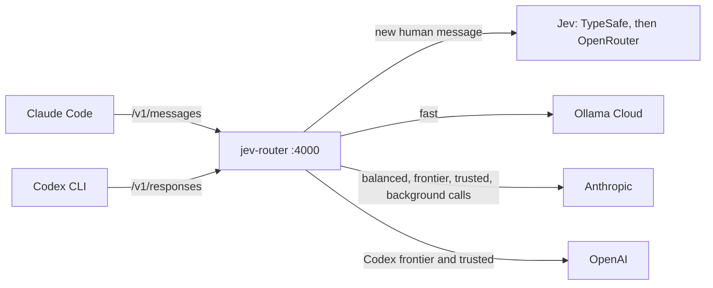

# jev-router in a Docker Sandbox

jev-router doesn't need Docker Sandboxes: on a Mac or Linux machine, the README's
[Quick start](../README.md#quick-start) is all there is. This guide is for running Claude Code and the Codex CLI in a
[Docker Sandbox](https://docs.docker.com/ai/sandboxes/). Like the plain setup, it needs no clone of the repository,
and it covers only what changes in a sandbox:

| | On your machine | In a Docker Sandbox |
| --- | --- | --- |
| Keys | `~/.config/jev-router/env`, loaded with `--env-file` | Stored on the host with `sbx secret set`. The kit declares them, and the sandbox proxy adds them to outgoing requests, so they never enter the sandbox |
| Install | `npm install -g github:dirien/jev-router#semver:^1` | The same command, inside the sandbox |
| Router | `jev-router serve --ui 4100 --env-file …` | `jev-router serve --ui 0.0.0.0:4100`, inside the sandbox |
| Live view | `http://127.0.0.1:4100` | The same address, once `sbx ports` forwards it to the host |
| Claude Code settings | `eval "$(jev-router env claude)"` or `~/.claude/settings.json` | `-e` options of `sbx run` |



The comments in the commands mark what has been run before:

- **verified** is backed by a successful run or by the Docker Sandboxes docs.
- **not run yet** hasn't run end to end. The check in the next step tells you whether it worked.

## What you need

- `sbx` on your Mac, signed in with `sbx login`. Install it with `brew trust docker/tap && brew install docker/tap/sbx`
  (verified). The kit passes `sbx kit validate` with sbx 0.45.1.
- A Jev key: TypeSafe (`console.typesafe.ai`, model `jev-1.13.0`) or OpenRouter (needs credits). One is enough.
- An Ollama Cloud API key, and optionally an OpenAI API key, which only Codex's `frontier` and `trusted` tiers use.
- For Anthropic, your Claude login works as is (verified): the router passes Claude Code's own credential to
  Anthropic only.

## 1. On the host: allow the kit, store the keys, create the sandbox

sbx only accepts kits from `docker.io/` by default, so allow jev-router's sources once. Then store the keys and
create the sandbox for the project you want to work on:

```bash
sbx settings set kit.allowedSources '["docker.io/","ghcr.io/dirien/","github.com/dirien/"]'
printf '%s' "$TYPESAFE_API_KEY"   | sbx secret set typesafe          # service id declared by the kit
printf '%s' "$OPENROUTER_API_KEY" | sbx secret set openrouter        # optional failover channel (verified)
printf '%s' "$OLLAMA_API_KEY"     | sbx secret set ollama-cloud      # service id declared by the kit
printf '%s' "$OPENAI_API_KEY"     | sbx secret set openai            # optional (verified)
export WS="$HOME/src/my-project"                                     # the project the agent works on
sbx create --name jev-router --kit ghcr.io/dirien/jev-router-kit:1.4.0 claude "$WS"   # flags verified; kit not run yet
```

Leave out the `printf … |` part to type a key at a prompt instead.

The release workflow publishes the kit to GHCR for every release: `:1.4.0` pins this release, and `:latest` follows
the newest one. The GHCR package stays private until its owner makes it public. Until then, sign in with
`docker login ghcr.io` and a token that can read packages, or have sbx read the kit from git:

```bash
sbx create --name jev-router --kit "git+https://github.com/dirien/jev-router.git#ref=v1.4.0&dir=sbx/jev-router-kit" claude "$WS"
```

While the repository is private, use `git+ssh://git@github.com/dirien/jev-router.git#ref=v1.4.0&dir=sbx/jev-router-kit`
instead.

The kit, [`sbx/jev-router-kit/spec.yaml`](../sbx/jev-router-kit/spec.yaml), declares the four keys as proxy-managed
services. Inside the sandbox each key variable holds the placeholder `proxy-managed`, and the proxy writes the real
`Authorization` header on the way out. The kit also allows the hosts the router talks to through the sandbox's
network policy, plus `registry.npmjs.org`, `github.com` and `codeload.github.com` for the install.

The first interactive run asks you to approve the kit's credential bindings, and since `sbx` 0.43 the default
answer is **No**. Answer yes. To skip the prompt, merge this into `~/.config/sbx/credentials.yaml` first:

```yaml
bindings:
  openrouter:   { apiKey: { domains: [openrouter.ai] } }
  typesafe:     { apiKey: { domains: [api.typesafe.ai] } }
  ollama-cloud: { apiKey: { domains: [ollama.com] } }
  openai:       { apiKey: { domains: [api.openai.com] } }
```

While the repository is private, npm inside the sandbox needs access to GitHub too. Docker Sandboxes can add a GitHub
token to the sandbox's git traffic; store one for this sandbox (not run yet with this kit):

```bash
sbx secret set github --sandbox jev-router -t "$(gh auth token)"
```

## 2. In the sandbox: install jev-router and start the router

```bash
sbx exec -it -w "$WS" jev-router bash                                # verified
```

Inside the sandbox, check that the proxy adds the keys, then install jev-router and write its config:

```bash
node --version && echo "NODE_USE_ENV_PROXY=$NODE_USE_ENV_PROXY"    # Node 22 or newer, and the variable must be 1
placeholder=proxy-managed                                            # what the kit puts in every key variable
for u in https://api.typesafe.ai/v1/models https://openrouter.ai/api/v1/key https://ollama.com/api/ps https://api.openai.com/v1/models; do
  printf '%s  %s\n' "$(curl -s -o /dev/null -w '%{http_code}' -H "Authorization: Bearer $placeholder" "$u")" "$u"
done                                                                 # 200: the key is injected; 401: it isn't
npm install -g github:dirien/jev-router#semver:^1                   # not run yet in a sandbox
jev-router init                                                      # writes ~/.config/jev-router/config.json
jev-router doctor
```

Node's built-in `fetch` uses the sandbox proxy only when `NODE_USE_ENV_PROXY=1`. Without it, requests bypass the
proxy, no key gets injected, and every upstream answers 401. If npm can't write to its global directory, run the
install with `sudo`.

There's no env file here: the kit already puts the key variables in the sandbox's environment. It sets both Jev key
variables, though, so the router treats both channels as configured. If you stored only one Jev key, delete the other
channel from `jev.channels` in `~/.config/jev-router/config.json` now. Otherwise the router spends a failed attempt on
it every five minutes.

Then start the router, and keep it running:

```bash
jev-router serve --ui 0.0.0.0:4100 --log-file ~/.local/state/jev-router/router.log
```

`--ui 0.0.0.0:4100` lets the view listen on the sandbox's network interface, so `sbx ports` can forward it. Without a
token, the router warns that anyone who can reach that address can watch routing decisions: models, tiers and costs,
never prompts or keys. To require a token, start the router this way instead, then open the address it prints, which
ends in `?token=`:

```bash
export JEV_ROUTER_UI_TOKEN="$(node -e 'console.log(crypto.randomUUID())')"
jev-router serve --ui 0.0.0.0:4100 --log-file ~/.local/state/jev-router/router.log
```

## 3. On the host: open the live view and start Claude Code

```bash
sbx ports jev-router --publish 4100:4100                            # then open http://127.0.0.1:4100
sbx run --name jev-router \
  -e ANTHROPIC_BASE_URL=http://127.0.0.1:4000 \
  -e CLAUDE_CODE_GATEWAY_HINT_HEADERS=1 \
  -e CLAUDE_CODE_AUTO_COMPACT_WINDOW=160000 \
  -e ENABLE_TOOL_SEARCH=true
```

`-e` on a re-attach applies to that session only (verified), so a plain `sbx run --name jev-router` still talks to
Anthropic directly and gives you a baseline to compare with. Alternatively, run `jev-router launch claude` in a
second sandbox shell: it finds the router from the first shell and starts Claude Code with the same variables. In
Claude Code, `/status` should show the base URL.

To check that each routing rule works, follow the
[routing walkthrough](activation.md#a-routing-walkthrough), then run `jev-router report` in a sandbox shell for the
requests, the spend per model and the savings.

## 4. Codex in the same sandbox

In a second sandbox shell:

```bash
npm install -g @openai/codex || sudo npm install -g @openai/codex   # package verified; npm prefix permissions vary
jev-router launch codex                                              # not run yet: first end-to-end run
```

`launch codex` writes the `jev` profile to `~/.codex/jev.config.toml` and starts `codex --profile jev`, using the
router from the first shell. The walkthrough has two Codex tests.

## Safety notes

- **The router stays on loopback.** Claude Code and Codex run in the sandbox too, so the router needs no other
  address. To reach the router itself from the host through `sbx ports`, it would have to listen on `0.0.0.0`, which
  it refuses without `JEV_ROUTER_TOKEN`. Clients then send `x-jev-router-token`: Claude Code through
  `ANTHROPIC_CUSTOM_HEADERS`, Codex through `env_http_headers`. If the published host port differs from the router's
  port, add `localhost:<host port>` to `allowedHosts`.
- **The keys.** The sandbox only ever holds the placeholder. The real keys stay on the host, and the proxy adds them
  for the hosts the kit names.
- **What's stored.** The state file (`~/.local/state/jev-router/sessions.jsonl`) and the log live inside the sandbox.
  The state file holds hashed session keys and tiers, the log decisions and costs, and neither holds prompt text or
  keys.

## Troubleshooting

These are the problems specific to a sandbox. [activation.md](activation.md#troubleshooting) covers the rest.

| Symptom | Likely cause and fix |
| --- | --- |
| sbx refuses the kit's source | `kit.allowedSources` doesn't include `ghcr.io/dirien/` or `github.com/dirien/`. Run the `sbx settings set` line from step 1. |
| sbx can't pull the kit from GHCR | The package is still private. Run `docker login ghcr.io` with a token that can read packages, or use the git reference. |
| `npm install` inside the sandbox asks for a username or can't find the repository | The repository is private and the sandbox has no GitHub credentials. See the end of step 1. |
| `reason: no-jev` | No channel has a key in the router's environment, so the kit isn't attached. Run `sbx kit add jev-router ghcr.io/dirien/jev-router-kit:1.4.0` on the host; this recreates the container. |
| `reason: fallback:default` and a `jev.error` | Jev didn't answer. Check the channel errors in `/healthz`, then run `sbx policy log jev-router` on the host. A 402 means OpenRouter has no credits; a 401 means the key isn't injected. |
| Every upstream answers 401, but the `curl` probes in step 2 pass | `NODE_USE_ENV_PROXY` isn't `1` in the router's shell, so Node's `fetch` bypasses the proxy. |
| 401 from Ollama | The `ollama-cloud` key isn't injected. See step 2's probe. |
| A 403 in the proxy's response | The network policy blocks the host. Run `sbx policy allow network --sandbox jev-router "<host>"` on the host. |
| The live view doesn't load on the host | The router isn't listening on `0.0.0.0`, or the port isn't forwarded. Check `--ui 0.0.0.0:4100` and `sbx ports jev-router`. |

## Teardown

On the host:

```bash
sbx stop jev-router && sbx rm jev-router
sbx secret rm ollama-cloud -f; sbx secret rm typesafe -f           # keep openrouter and openai if you use them elsewhere
```

Then remove the `bindings` entries from `~/.config/sbx/credentials.yaml`. The router's config, state and log lived
inside the sandbox, and nothing was cloned, so there's nothing else to delete.
